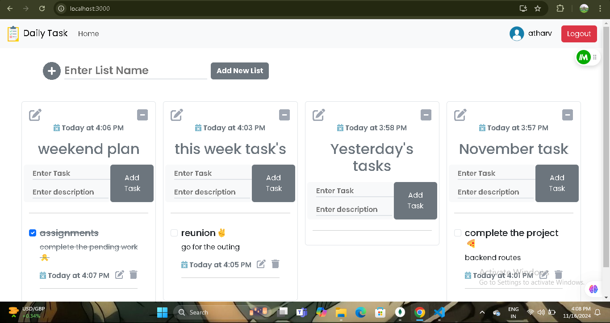

### Project Screenshots 


## Steps to configure and todolist frontend:

1. Open  todolist folder in vscode 

2. Open a new terminal and run following commands,

```bash
   cd todolist
```
- it will modify the path by adding the todolist folder for next command.

```bash
  npm install react-scripts
```

3. After that you can run frontend by using this command,

```bash
  npm start
```

## Steps to configure and run backend/server:

1. Open backend folder in vscode 

2. Open a new terminal and run following commands,

```bash
   cd backend
```
- it will modify the path by adding the backend folder for next command.

```bash
  npm install express
```
- to install express in your code.

3. After that you can run frontend using this command,

```bash
   nodemon index.js
```

## Tech Stack

#### Frontend
[](https://github.com/DurgeshBhoye/Instagram-Clone-App)


#### Backend


#### Databases


